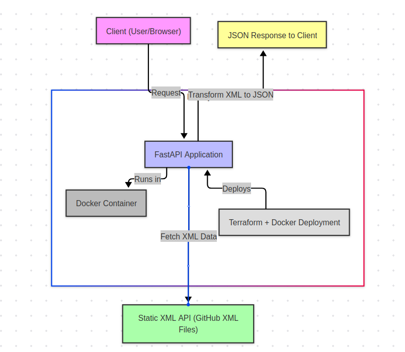
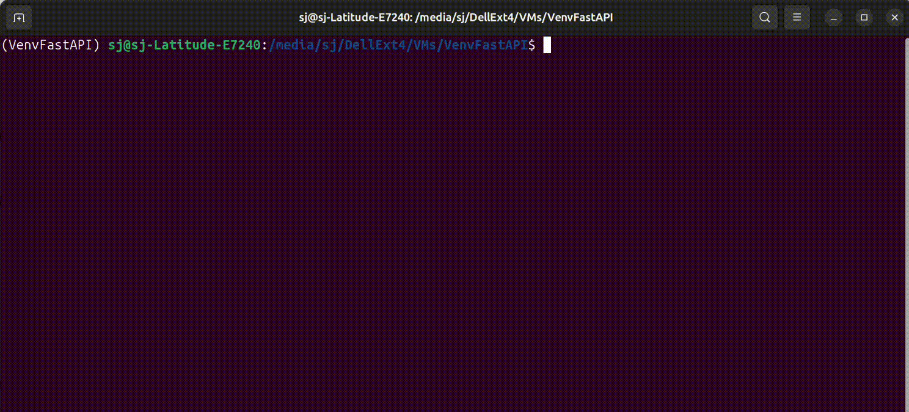

# MWNZ Companies API

This is a FastAPI-based backend application that fetches company data from a static XML API, transforms it into JSON, and serves it according to the OpenAPI specification.

## Features
- Fetches company data from static XML files
- Transforms XML into JSON format
- Implements OpenAPI 3.0 for documentation
- Uses FastAPI and Pydantic for data validation
- Supports automatic API documentation with Swagger UI & ReDoc

---

## System Design

The following diagram illustrates the architecture of the MWNZ Companies API:


---

## Deployment & Usage

### Deploy with Terraform and Docker
This project includes a Terraform script to deploy the FastAPI application using Docker.

#### **1. Initialize Terraform and Apply Configuration**
```bash
cd infrastructure
terraform init
terraform apply -auto-approve
```

#### **2. Verify Running Container**
```bash
docker ps
```

The application should now be running on `http://127.0.0.1:8000`.

### Fetch Company Data by ID
#### **Request**
```bash
curl -X GET "http://127.0.0.1:8000/companies/1" -H "Accept: application/json"
```
#### **Response (Example)**
```json
{
  "id": 1,
  "name": "MWNZ",
  "description": "..is awesome"
}
```
---

## Deploy with Terraform and Docker



---

## Installation & Setup

### Clone the Repository
```bash
git clone https://github.com/Junnicesu/EvalCompanyAPI.git
cd EvalCompanyAPI
```

### Create and Activate a Virtual Environment
```bash
python3 -m venv venv  # Create virtual environment
source venv/bin/activate  # Activate (Linux/macOS)
venv\Scripts\activate  # Activate (Windows)
```

### Install Dependencies
```bash
pip install -r requirements.txt
```

### Run the FastAPI Application
```bash
uvicorn src.main:app --reload
```

- The API will now be available at: **`http://127.0.0.1:8000`**
- Interactive API documentation:
  - **Swagger UI**: [http://127.0.0.1:8000/docs](http://127.0.0.1:8000/docs)
  - **ReDoc**: [http://127.0.0.1:8000/redoc](http://127.0.0.1:8000/redoc)

---

## Project Structure
```
.
├── src/
│   ├── main.py        # FastAPI app entry point
│   ├── models.py      # Pydantic models
│
├── infrastructure/    # Terraform deployment scripts
├── requirements.txt   # Python dependencies
├── README.md          # Project documentation
```


---

## License
This project is licensed under the MIT License.


---

## Contact
For issues, please open a GitHub Issue or contact [your.email@example.com](mailto:tobexinminsu@gmail.com).

